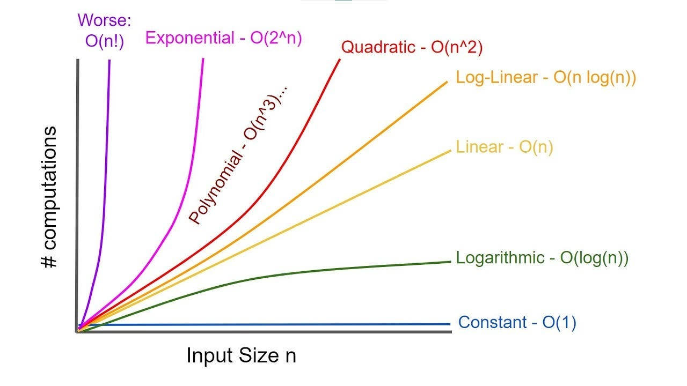

Algorithmic complexity
time complexity and space complexity

First we need to understand that time complexity is a measure of an algo not for an hardware or computer/laptop/pc an old computer taking 10 secs and an new one taking one second will have same time complexity for the algo that is executed.

TIME COMPLEXITY != TIME TAKEN

Always look for the worst case because a large data can crash your code or has high chance than a small data. basically this means how will your algorithm perform or what it will do or how much optimize is it when the data grows.

Yes, **algorithms with different time complexities can appear to perform similarly on small data sizes**, and may even show similar trends on performance graphs

Lets say we have O(n) and we have constant like x, 2x, 4x for the slope on a graph each will have diff value but same complexity that is O(n), so we really dont care about constants as the complexity will remain same

lets say we have O(n3) + O(log n) for some algo, so we will have O(n3) because we will always ignore the less dominant that is log (n)

An **upper bound** is a limit that tells us the **maximum amount of resources (typically time or space)** an algorithm will ever take to complete, _no matter the input_.

lets say we have an algo with worst case as O(n3) so this is the ***upper bound*** the limit it will remain inside this it will never exceed this your algo may be solved in O(n) or O(log n) but not more than O(n3)

$$
{f} (N) = O (g (N) ) 
$$

Big O -> upper bound

we have a very famous formula 
$$
\lim_{N \to \infty} \frac{f(N)}{g(N)} < \infty
$$

Now lets say for ***lower bound*** -> Big Ω

we can say 

$$
0 < \lim_{n \to \infty} \frac{f(n)}{g(n)}
$$

Now lets say we have something lets say the upper bound & lower bound both are also N2 

Big Θ -> tight bound
then it is

$$ 0 < \lim_{n \to \infty} \frac{f(n)}{g(n)} < \infty $$

#Note 

Time complexity is a way to analyze an algorithm's efficiency by measuring how the number of operations grows as the input size grows (n).

or you can say it is a measure of how the runtime of an algorithm grows as the input size grows

three different notations
- BIG - O #Worst refers to the behavior of an algorithm in worst case scenario
- BIG - Ω #Best  (Omega) best case scenario
- BIG - Θ #Average  (Theta) average case scenario 

Common Complexities

- Constant - O(1) ==most efficient==
- run time of the algorithm is constant, no matter what the size is, it does not depend on the input size

- Linear - O(n)
- The runtime of the algorithm grows linearly with the input size. For example, iterating through an array of size n is O(n) because the time it takes to iterate through the array is proportional to the size of the array.
- n = 5, no of operations = 5
- sliding window, monotanic stack

- Quadratic time - O(n^2)
- insertion sort
- traverse a square matrix 2d array
- Even if the inner loop does not run for the entire length of the outer loop, the time complexity is still O(n^2) because the outer loop runs n times and the inner loop runs proportionally to the length of the input array.

- O (n \* m) 2d array that is not sqaure
- 
- 