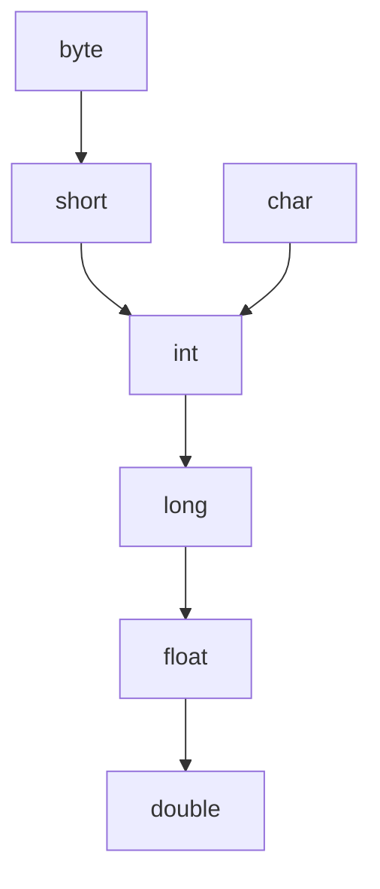
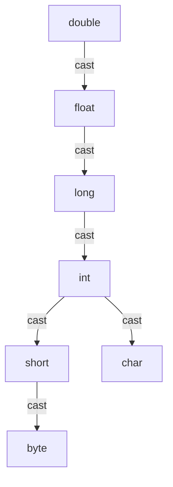

main() method can be declared with the following modifiers. final, synchronized, strictfp.

#note 
default value for reference is null

#imp
In **Java**, every variable that is **not explicitly initialized** will be assigned a **default value** by the JVM **only if** it is a **member (instance or static) variable**. Local variables **must be initialized** before use and we can only have final for it no other modifier.
if we are not declaring any modifier explicitly then it means default modifier but this rule is applicable only for static and instance variables but not local variable.

### ✅ Default Values of Data Types in Java

| **Data Type**                                   | **Default Value**         |
| ----------------------------------------------- | ------------------------- |
| byte                                            | 0                         |
| short                                           | 0                         |
| int                                             | 0                         |
| long                                            | 0L                        |
| float                                           | 0.0f                      |
| double                                          | 0.0d                      |
| char                                            | '\u0000' (null character) |
| boolean                                         | false                     |
| Object reference (like String, arrays, classes) | `null`                    |

# what happens if

| Case                           | Class Loaded (Method Area) | Object Created (Heap) | Memory Usage                      |
| ------------------------------ | -------------------------- | --------------------- | --------------------------------- |
| Empty `.java` file             | ❌ No                       | ❌ No                  | 0                                 |
| Empty class                    | ✅ Yes                      | ❌ No                  | Tiny (metadata only)              |
| Object of empty class created  | ✅ Yes                      | ✅ Yes                 | Metadata + 16–32 bytes per object |
| No object usage (null or none) | Maybe (if used elsewhere)  | ❌ No                  | Small to none                     |
it is a clean code practise to access the static members using the class name and dot operator

```java
public class Main {  
    static int x = 10;  
  
    public static void main(String[] args) {  
        System.out.println(Main.x);  
        System.out.println(Call.x);  
    }  
}  
  
class Call {  
    static int x = 11;  
    private Call() {  
        throw new IllegalArgumentException("Go to hell");  
    }  
}
```

# why we use constructor call in the object instantiation 

The constructor's main job is to **override those default values** with meaningful ones that you actually want.

to just over ride the default values, and assign the values you have given

#mostimp
the object is created in the heap when new is encountered by jvm with defualt values like null 0 but construcotr assigns the state given.
dynamic allocate it is runtime process which happens when new keyword is encountered means the memory will be allocated during the runtime 
#mostimp constructor is a special method which will have same name as class.

# the classic swap problem

variables does not gets swap if you do this
```java
public class Main {
    public static void main(String[] args) {
        int a = 5;
        int b = 10;
        swap(a, b);
        System.out.println("a = " + a + ", b = " + b);  // Still a = 5, b = 10
    }

    public static void swap(int x, int y) {
        int temp = x;
        x = y;
        y = temp;
    }
}
```

this is because everything in java is pass by value, even the objects, and java tends to pass copy of the value to the x and y variables and not the reference of the variable a and b in the stack as swap is also a method so a new stack frame will be created with x and y which will match the value of as given to them from a to b

```java
class Box {
    int value;

    Box(int value) {
        this.value = value;
    }
}

public class Main {
    public static void main(String[] args) {
        Box a = new Box(10);
        Box b = new Box(20);

        System.out.println("Before swap:");
        System.out.println("a.value = " + a.value);
        System.out.println("b.value = " + b.value);

        swap(a, b);  // Will not work
        System.out.println("\nAfter swap (doesn't work):");
        System.out.println("a.value = " + a.value);
        System.out.println("b.value = " + b.value);

        swapValues(a, b);  // Will work
        System.out.println("\nAfter swapValues (field swap works):");
        System.out.println("a.value = " + a.value);
        System.out.println("b.value = " + b.value);
    }

    // ❌ This won't affect original references
    public static void swap(Box x, Box y) {
        Box temp = x;
        x = y;
        y = temp;
    }

    // ✅ This will swap the actual values inside the objects
    public static void swapValues(Box x, Box y) {
        int temp = x.value;
        x.value = y.value;
        y.value = temp;
    }
}

```

need to make your own wrapper to swap object values like this as the wrapper classes are immutable they are final


final variable initialize when

|Scope|Must be initialized when?|
|---|---|
|Local|Before use — either at declaration or later|
|Instance `final`|At declaration or in constructor|
|Static `final`|At declaration or in static block|

class can only be default and public it cannot be private or protected

.class contains the bytecode instructions after javac compiles a .java file we can see this by using javap -c and the class name like Main.java and why are these called bytecode instructions because size of every instruction is 1 byte(8 bits) exactly and these bytecode instructions are meant for the jvm they are understood by the jvm, which converts them to machine code

JVM Is a runtime engine or you can say a virtual machine as well because it stimulated a computer system it can do memory management, loading, run then according to the host machine match the host machine configurations, jvm has to be compatible with the os it is being used on

# IS JAVA OOPS PURELY OR NOT?

Java has primitive types int float long double char they are not objects not either they are class
Everything should be accesses using message passing (through objects)
One object **sends a message** to another object by **invoking its method** — asking it to perform an action or return some information.
but java has static variables and methods which do not need objects to be accessed

java do not has multiple inheritance, we support it by using interface

but every thing is contained in a class the primitive the keyword void are represented as a object of the class 
Class, it means they are part and parcel of class definition and should not be considered as individual elements

adaptive optimizer (using interpreter and jit together)


> `import` is for the **compiler**, not the JVM.  
>  JVM uses fully-qualified class names found in bytecode.  
> When a method is called, the JVM runs the actual method **in the original class** — it does **not copy or inject** code into yours.

methods accept some data from outside they can also return some reuslt

we do not want to make main method an object to be called with so we use static and made it public so that jvm will find it it should match the signature String[] args then only this main will be picked up 

bedefault jvm treats numbers to be int type to make it use long you have to specifiy L 

same goes with float and long bydefault we will have a decimal to be double we need to use F or D to specifiy it

single precision floating point numbers (float) 7 decimal places, double precisoin floating point numbers(doble) 15 decimal places

we can use underscore __ in numeric litreals like 10_3_33 like this as well 

0b1101 binary
023 octal
0x16 hex
1212 decimal

sign bit 0 represents a positive number and 1 represents a negative number dont confuse with true false
>>> we also have this the are zero fill right shift operator fills sign bit to be 0

ternary is also called conditional operator

. -> member operator the dot (.) 

sequential statement => one by one execution
control statements => repeatedly and randomly

in do while statements executed first but in while condition then statements 

we should use do while and while when we do not know the number of iteration they will run till the condition is false for loop fixed number of times 

you can also use  for (; ;) like this no issue 

we can also give like this for(int i = 1, int j = 1; i < 4; i++, j--)

we can use System.exit(0) to normally termiate a program while exit(1) means some error terminated the program 

we can call a main method of a class in a different class using classname.main() we just have to pass a string type array to it.

we can use like this 
```java
int String = 10;
String Integer = 12;

// but not recommended
```

also the identifier name can be of any length but not recommended more than 15

| Element   | Casing Convention | Example            |
| --------- | ----------------- | ------------------ |
| Class     | PascalCase        | `StudentDetails`   |
| Interface | PascalCase        | `Runnable`, `List` |
| Enum      | PascalCase        | `DayOfWeek`        |
| Method    | camelCase         | `getStudentName()` |
| Variable  | camelCase         | `studentAge`       |
| Constant  | UPPER_SNAKE_CASE  | `MAX_SIZE`         |
| Package   | lowercase         | `com.example.app`  |

== Overview

In Java, positive and negative numbers for integral types (`byte`, `short`, `int`, `long`) are represented using the **Two's Complement** binary system.

== Sign Bit

- The **Most Significant Bit (MSB)** (i.e., the leftmost bit):
  - `0` ⇒ Positive number
  - `1` ⇒ Negative number

== Two’s Complement System

To represent a negative number:
1. Take the binary of the positive number.
2. Invert all bits (1’s complement).
3. Add `1` (to get 2’s complement).


length tells the size of array or you can say rows  and length() number of characters in a string 

```java
package iftest;  
  
public class If {  
    public static void main(String[] args) {  
        int[][][] a = new int[2][3][3];  
        System.out.println(a[0][0].length);  
    }  
}
```

answer is 3 for `a[0][0] and a[0]` but for a it is 2







we can over load the main method 
You can overload `main()` like any method, but:

- JVM **only** calls `public static void main(String[] args)` automatically.
    
- Other overloads must be called **explicitly**.
### Inheritance & `main()`

Static methods (including `main()`) follow **method hiding**, not overriding.

`class Parent {     public static void main(String[] args) {         System.out.println("Parent main");     } } class Child extends Parent {}`

✅ Output: If run as `java Child`, but no `main()` in `Child`, then Parent’s main runs.

### Method Hiding (not Overriding)

java

CopyEdit

`class Parent {     public static void main(String[] args) {         System.out.println("Parent main");     } } class Child extends Parent {     public static void main(String[] args) {         System.out.println("Child main");     } }`

✅ Output: `Child main` (when you run `java Child`)

all wrapper classes are also immutable we can also create our own mutable and immutable classes

| Feature        | Immutable                            | Mutable                  |
| -------------- | ------------------------------------ | ------------------------ |
| Field access   | Private, final                       | Private                  |
| Modifiable     | ❌ No setters                         | ✅ Setters available      |
| Thread-safe    | Yes (by default)                     | No (unless synchronized) |
| Defensive copy | Required for mutable fields          | Optional                 |
| Use-case       | Keys in maps, cache, concurrent data | DTOs, data containers    |
Note: Every method present inside a final class is always final by default whether we are declaring or not. But every variable present inside a final class need not be final.